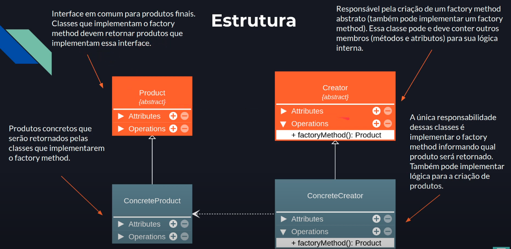

# Factory

Tags: Criacional
Refactoring Guru: https://refactoring.guru/design-patterns/factory-method

# Intenção

Definir uma interface para criar um objeto, mas deixar as subclasses decidirem que classe instanciar. O Factory Method permite adiar as instanciação para as subclasses.

Fábrica são simplesmente operações que criam objetos.

### Factory Method

- É um padrão de projeto de criação (lida com a criação de objetos).
- Oculta a lógica de instanciação do código cliente. O método fábrica será responsável por instanciar as classes desejadas.
- É obtido através de herança. O método fábrica pode ser criado ou sobrescrito por subclasses.
- Dá flexibilidade ao código cliente permitindo a criação de novas factories sem a necessidade de alterar o código já escrito (ocp).
- Pode usar parâmetros para determinar o tipo dos objetos a serem criados ou os parâmetros a serem enviados aos objetos sendo criados.

## Estrutura

**Aplicabilidade**

- Use o factory method quando não souber com certeza quais os tipos de objetos o seu código vai precisar.
- Use o factory method para permitir a extensão de suas factories para criação de novos objetos (isso ajuda a aplicar o Open/Closed Principle).
- Use o factory method para dar um hook (gancho) às subclasses para permitir que elas decidam a lógica de criação de objetos.
- Use o factory method para eliminar duplicação de código na criação de objetos.

### BOM x RUIM

### **Bom**

- Ajuda a aplicar o Open/Closed Principle. Seu código vai estar aberto para extensão
- Ajuda na aplicação do Single Responsibility Principle. Separa o código que cria do código que usa o objeto
- Ajuda no desacoplamento do seu código

### **RUIM**

- Se usado sem necessidade, pode causar uma explosão de subclasses. Será necessário uma classe `ConcreteCreator` para cada `ConcreteProduct`.