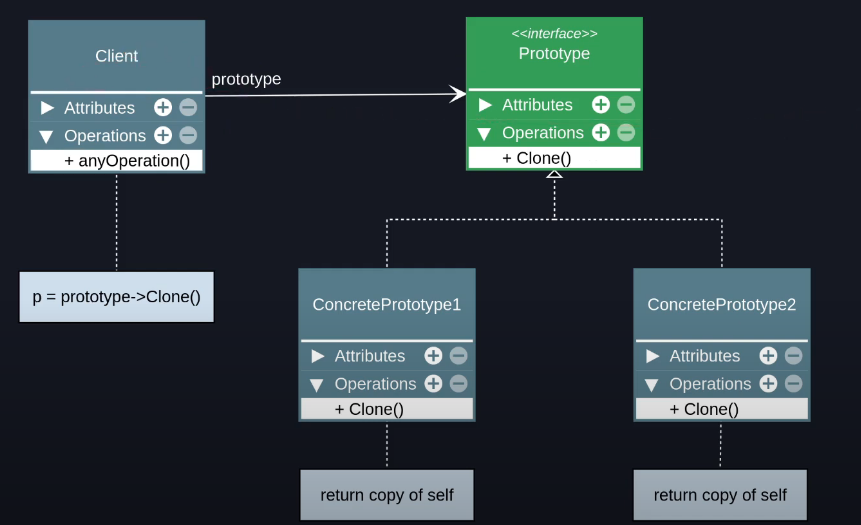

# Prototype

Tags: Criacional
Refactoring Guru: https://refactoring.guru/design-patterns/prototype

# Intenção

Especificar os tipos de objetos a serem criados usando uma instância-protótipo e criar novos objetos pela cópia desse protótipo.

- O tipo de objeto a ser criado é determinado pelo objeto protótipo
- É tipicamente usado para evitar a recriação de objetos “caros”
- Ajuda a evitar explosão de subclasses
- Pode (ou não) manter um registro de objetos protótipo em um objeto separado
- Geralmente é criado apenas com um método “clone” dentro do objeto protótipo
- O método clone pode gerar uma “shallow” ou “deep” copy do objeto protóti

## Estrutura

**Aplicabilidade**

- Use o padrão prototype quando precisar que seu código não dependa de classes concretas para a criação de novos objetos.
- Use o padrão prototype quando quiser evitar explosão de subclasses para objetos muito similares.
- Use o padrão prototype para evitar a recriação de objetos “caros”.

### BOM x RUIM

### **Bom**

- Oculta classes concretas do código cliente
- Ajuda na criação de objetos caros ou complexos
- Evita a explosão de subclasses

### **RUIM**

- Clonar objetos que tem referência para outros objetos pode ser super complexo.